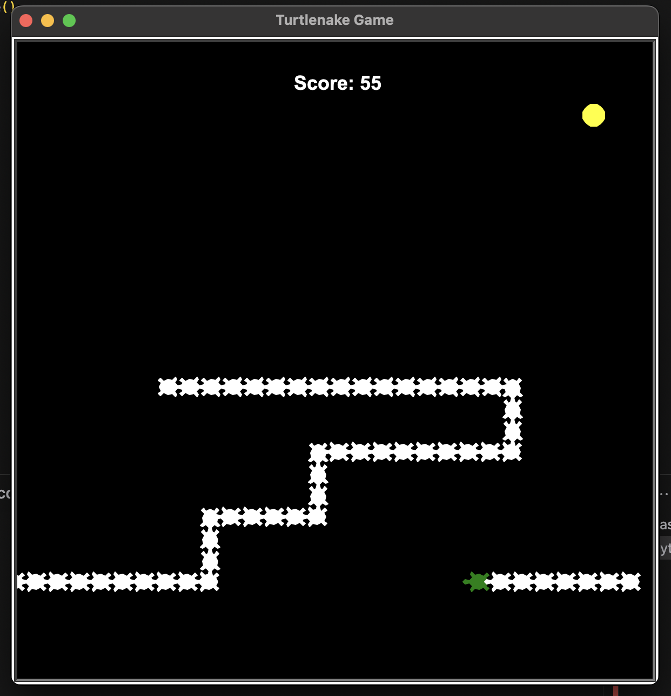

# Turtlenake 🐢

A classic Snake game implemented with Python's Turtle graphics library, featuring a green turtle that grows longer as it eats cookies!

## How to Play

Control a hungry turtle as it moves around the screen eating cookies. Each cookie eaten makes the turtle's tail grow longer. Be careful not to run into your own tail!

The turtle can move through the screen edges and will appear on the opposite side.

### Controls

- **Up Arrow** - Move turtle upward
- **Down Arrow** - Move turtle downward
- **Left Arrow** - Move turtle left
- **Right Arrow** - Move turtle right
- **P** - Pause/Unpause game
- **R** - Restart game

### Game Over

The game ends if your turtle runs into its own tail. You'll then have the option to restart the game.

### Scoring

- Each cookie eaten increases your score by 1 point
- Score is displayed at the top of the screen

## Features

- Smooth turtle movement
- Screen wrapping (turtle appears on opposite side when crossing boundaries)
- Score tracking
- Pause functionality
- Game restart option
- Growing tail mechanics
- Cookie spawning system
